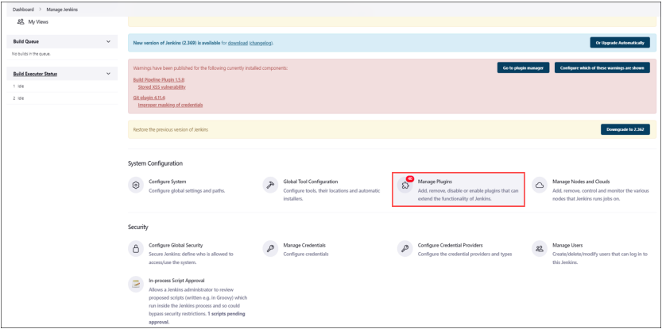
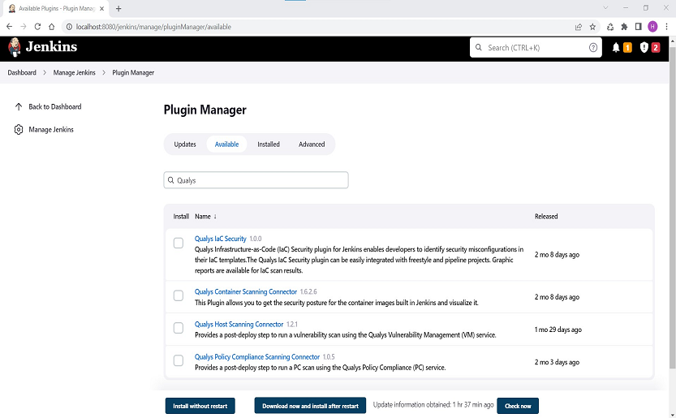
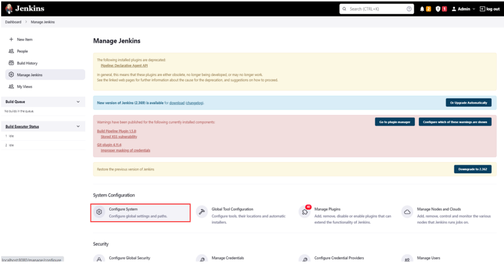
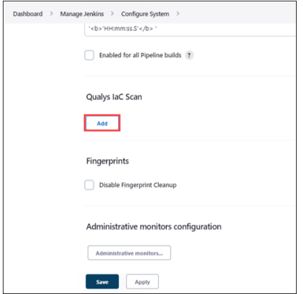
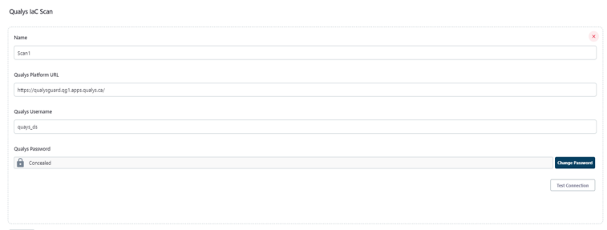
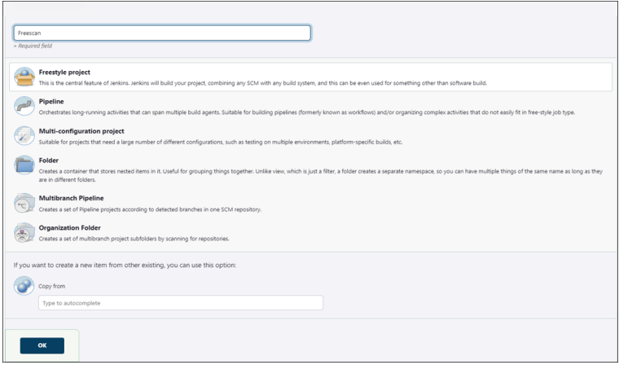
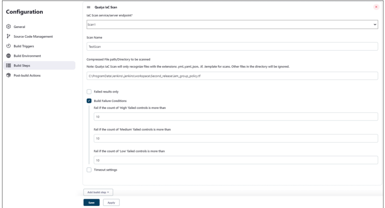
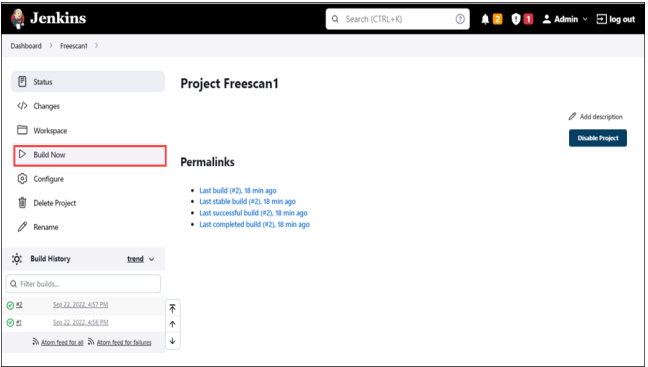

# Qualys

Qualys laC Security Integration with Jenkins

In the existing Continuous Integration and Continuous Deployment (CICD) environment,
the security scans are conducted on cloud resources after deployment. As a result, you
secure your cloud resources post-deployment to respective Cloud accounts.

With an introduction of the Infrastructure as Code (IaC) security feature by Qualys Cloud-
View, you can now secure your IaC templates before the cloud resources are deployed in
your cloud environments. The IaC Security feature will help you shift cloud security and
compliance posture to the left, allowing evaluation of cloud resources for misconfigura-
tions much early during the development phase.

CloudView offers integration with Jenkins to scan and secure your IaC templates using the
Jenkins pipeline job. It continuously verifies security misconfigurations against CloudView
controls and displays the misconfigurations for each run. With a continuous visibility of
the security posture of your laG Templates at Jenkins pipeline you can plan for remedia-
tion to stay secure post deployment.

For supported templates, other integrations, and features of Cloud laC Security, refer to
CloudView User Guide and CloudView API User Guide.

Copyright 2022 by Qualys, Inc. All Rights Reserved.
Qualys laC Security Integration with Jenkins
Scanning laC Templates at Jenkins

## Scanning laC Templates at Jenkins

The Jenkins integration allows you to perform IaC scans using pipeline job. We provide
you with a pipeline job and options that you can configure to run based on various
triggers.

You can perform an IaC scan on either of the following:
- the entire git repository.
- only the templates that were newly added / updates to the branch.

The results are generated on the build console that provides you with proactive visibility
into the security of your laC templates residing in Git repositories.

## Pre-requisite

- Ensure that you have a valid docker pipeline plugin installed.

- Ensure to configure environment variables used in the pipeline script before you run the
pipeline job in Jenkins. For more info, refer Configure the Plugin.

- To auto-trigger a Jenkins pipeline job, ensure that you install a specific Source Code
Management (SCM) plugin, e.g., Bitbucket plugin, Bitbucket Server Integration. For auto-
trigger, the pipeline job must contain a Jenkins file.

- Docker must be installed on the Jenkins agent node.

- Ensure that you have a valid Qualys CloudView Security Assessment app subscription.

## Let us see the quick workflow:

- Configure the Plugin
- Configure System
- Run IaC Scan
- View Scan Output

## Configure the Plugin

Before running a scan, we have to install the IaC plugin on your Jenkins console.
To deploy a plugin,

- On the Jenkins console, go to Manage Jenkins > Manage Plugins.

- Navigate to Available plugin in the plugin manager and search Qualys IaC Security plugin.

## Configure System

- On the Jenkins console, go to Manage Jenkins > Configure System

- Scroll down till you see the Qualys IaC Scan then click on Add.

- Enter your Qualys credentials.
- Click Test Connection to ensure you are authenticated. The plugin will not be able to 
perform scans unless the test connection is successful.

- Click Save and Apply.

## Run IaC Scan

Once we’ve deployed the IaC plugin and authenticated ourselves, we can run scans on 
selected templates. 

- On the Jenkins console, click New Item.

- Enter the name and select the type of project

- In the Build Steps, scroll down to Qualys IaC Scan. 
- Enter the required information.
- Enter the path to the IaC template(file extension must be .yml, .yaml, .json or .tf).
- You can choose to display failed results only, set the build failure conditions and 
timeout period.

- Return to the Jenkins Console and click Build Now

## View Scan Output

- At the end of the job, the Jenkins pipeline creates the artifact file. 
- Go to Console Output to view the scan report for a selected pipeline job.
- To view the scan report in detail, go to Qualys IaC Scan Report.
- The Build Summary displays the failed controls of all the scanned templates. The failed 
scans are categorized based on their criticality. View the failed controls on the IaC Posture 
tab. Lastly, check the Remediation tab to learn how you can resolve the misconfiguration.
- You can download the report as a Json file and view it locally as well.
